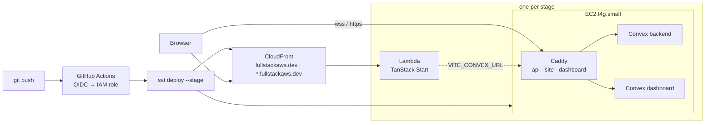

# mnlth

A full-stack TypeScript app on your own AWS account. TanStack Start on Lambda,
a self-hosted Convex backend on EC2, one shared CloudFront in front, all
described in SST and deployed by `git push`.

- **Push `main`, ship production.** Branches and pull requests get their own
  full stage at `<name>.fullstackaws.dev`, removed when the PR closes.
- **Convex without the cloud bill.** The open-source backend runs on a single
  arm64 instance behind Caddy, with real-time queries, a dashboard, and TLS
  from a wildcard certificate.
- **Nothing to log in to.** CI assumes an IAM role through OIDC. Admin keys
  are minted by the backend and kept in SSM. No secrets live in GitHub.
- **Runs on a laptop with only Docker.** `bun local` brings up the same
  compose stack the servers run.

## Stack

| Layer | What | Where it runs |
| --- | --- | --- |
| Web | [TanStack Start](https://tanstack.com/start) (React 19, TanStack Router), Vite 8, Tailwind 4, [shadcn/ui](https://ui.shadcn.com) on Base UI | Lambda with response streaming, behind one CloudFront distribution shared by every stage |
| Backend | [Convex](https://convex.dev) self-hosted: functions in `packages/backend/convex`, SQLite or RDS, files on the volume or S3 | One `t4g.small` EC2 instance per stage, Docker Compose, Caddy for TLS |
| Infrastructure | [SST v4](https://sst.dev) with a custom `ConvexBackend` component | `sst.config.ts`, `infra/` |
| Delivery | GitHub Actions, OIDC to AWS, one reusable deploy workflow | `.github/workflows` |
| Tooling | Bun, Turborepo, Biome, TypeScript 6 | |

## Architecture



Production owns the shared pieces: the VPC, the certificate bucket Caddy keeps
its wildcard certificate in, and the CloudFront router whose `*.fullstackaws.dev`
alias is how every other stage gets a subdomain without a distribution of its
own. It publishes their ids to SSM; every other stage reads them at deploy
time. Production deploys first and is removed last.

| | Production | Any other stage |
| --- | --- | --- |
| Web | `fullstackaws.dev` | `<stage>.fullstackaws.dev` |
| Convex | `api.` · `site.` · `dashboard.fullstackaws.dev` | `<stage>-api.` · `<stage>-site.` · `<stage>-dashboard.fullstackaws.dev` |

## Repository

```
apps/web/                  TanStack Start app (Nitro aws-lambda preset in vite.config.ts)
packages/backend/convex/   Convex schema and functions
packages/ui/               shadcn/ui components, Tailwind config, global CSS
infra/convex-backend.ts    the ConvexBackend component: instance, Caddy, DNS, SSM, S3, RDS
infra/shared.ts            production publishes shared ids to SSM; other stages read them
infra/settings.ts          loads and validates sst.settings.json
docker/docker-compose.yml  the Convex stack, run by the instances and by `bun local`
scripts/convex-deploy.ts   pushes functions to a stage's backend (URL and key from SSM)
scripts/local.ts           the whole app on this machine, no AWS
scripts/reset-aws.sh       empties a region with the AWS CLI, independent of SST state
sst.config.ts              the app; sst.settings.json holds domain, region and per-stage choices
```

## Quick start

### On your machine, Docker only

```bash
bun install
bun local            # backend + dashboard in Docker, functions pushed on save, Vite on :3000
bun local --reset    # wipe the local database and files first
bun local --down     # stop the containers
```

`scripts/local.ts` starts `docker/docker-compose.yml` with a generated
`INSTANCE_SECRET` kept in `docker/.env` (gitignored, so the admin key stays
valid across restarts), mints an admin key into `packages/backend/.env.local`
for the Convex CLI, then runs `convex dev` and Vite with
`VITE_CONVEX_URL=http://127.0.0.1:3210`. The dashboard is at
http://127.0.0.1:6791 and asks for that key on first open.

### A personal stage in AWS

```bash
bun sst dev --stage <you>
```

Deploys the stage (its EC2 backend included, so the first run takes a few
minutes), then runs Vite on http://localhost:3000 against that stage's
backend. Push function changes with `bun convex:deploy --stage <you>`, or run
`bun convex:deploy --stage <you> --dev` alongside to push on every save. Only
point `sst dev` at your own stage, never at `staging` or `production`: it
leaves dev-mode resources behind until the next `sst deploy`.

### Adding UI components

```bash
bunx shadcn@latest add button -c apps/web
```

Components land in `packages/ui/src/components` and are imported from the
workspace package:

```tsx
import { Button } from "@workspace/ui/components/button"
```

Backend functions reach the web app as generated types:

```tsx
import { api } from "@workspace/backend/convex/_generated/api"
import { useQuery } from "convex/react"

const messages = useQuery(api.chat.getMessages)
```

## Deploying

Git drives every deployment. GitHub Actions assumes the `github-actions-sst`
IAM role through OIDC, runs Biome and typecheck, then `sst deploy` and the
Convex functions push.

| Git event | Stage | Lifetime |
| --- | --- | --- |
| push to `main` | `production` | permanent, protected |
| push to a branch listed under `stages` | that stage | until removed |
| pull request #N | `pr-N` | removed when the PR closes |
| any other branch | none, lint and typecheck only | |

Which branches deploy is the `stages` map in `sst.settings.json`. Adding a
developer or an environment is one line there:

```json
"stages": { "main": "production", "staging": "staging", "christianstamati": "christianstamati" }
```

Pull requests from forks and draft pull requests are not deployed. A PR gets
a comment with its URLs after each deploy. The first deploy of a new stage
takes ten to twenty-five minutes (the box boots, pulls images, gets its
certificate, mints its admin key); later pushes take a few.

| Workflow | Runs on | Does |
| --- | --- | --- |
| `ci.yml` | every push and PR | Biome, typecheck |
| `deploy.yml` | called by the others | the one deploy job |
| `deploy-branch.yml` | push | maps the branch through `stages`, deploys |
| `deploy-pr.yml` | PR opened, pushed, reopened, ready for review | deploys `pr-N`, comments |
| `remove-pr.yml` | PR closed | `sst remove --stage pr-N`, drops its state |
| `manual.yml` | Actions tab | `deploy`, `remove`, `unlock` or `refresh` any stage |

`unlock` is for a job that died mid-deploy and left the state lock behind;
`refresh` for after something was changed by hand in AWS.

### From a laptop

The same commands CI runs:

```bash
bun sst deploy --stage production
bun convex:deploy --stage production --wait
bun sst remove --stage <stage>      # production refuses
```

### CI credentials

The role's trust policy accepts tokens whose subject names this repository.
GitHub includes the owner's and repository's numeric ids in that subject, so
the policy matches both `repo:christianstamati/mnlth:*` and
`repo:christianstamati@<owner id>/mnlth@<repo id>:*`. Its ARN is the
repository variable `AWS_ROLE_ARN`. Nothing else is stored in GitHub.

### SST Console

The [SST Console](https://console.sst.dev) reads state straight from the
`sst-state-*` bucket, so it lists every stage whoever deployed it, with its
outputs, the web Lambda's logs and its uncaught errors. Connect the AWS
account there once and pick `eu-central-1`. Leave Autodeploy off: GitHub
Actions is the deploy engine, and both would race for the state lock.

### Deployment settings

`sst.settings.json` holds what varies per deployment but not per stage. Only
`domain` and `region` are required; the rest default to what is shown here.

```json
{
  "domain": "fullstackaws.dev",
  "region": "eu-central-1",
  "protect": ["production"],
  "removal": { "production": "retain", "*": "remove" },
  "storage": { "production": "s3", "*": "volume" },
  "database": { "production": "mysql", "*": "sqlite" },
  "stages": { "main": "production" }
}
```

`protect` lists stages whose resources refuse deletion. `removal` is what
`sst remove` does with resources: `remove`, `retain` (keeps the VPC, subnets
and any RDS instance) or `retain-all`. `storage` (`volume` | `s3`) and
`database` (`sqlite` | `postgres` | `mysql`) pick the Convex backend's file
storage and database engine. Each is one value or a map keyed by stage with
`*` as the fallback. Stage names must be lowercase letters, digits and
hyphens, at most 24 characters: they become hostname labels, and
`sst.config.ts` refuses anything else before touching AWS.

## The Convex backend

### What the instance runs

Amazon Linux 2023 on arm64. At first boot, userData installs Docker and the
compose plugin, downloads a Caddy build with the Route 53 and S3 plugins,
writes `docker/docker-compose.yml` and a `.env` assembled from SSM, and starts
both. Caddy terminates TLS for the three hostnames with one wildcard
certificate for `*.fullstackaws.dev` (DNS-01 through Route 53), stored in the
shared certificate bucket so it is issued once for every stage and every
replacement instance. The compose ports are bound to loopback; the security
group opens 80 and 443 to the internet and 22 to EC2 Instance Connect's range
only.

| Public host | Local target | What |
| --- | --- | --- |
| `<prefix>api.` | `127.0.0.1:3210` | API and WebSocket |
| `<prefix>site.` | `127.0.0.1:3211` | HTTP actions (404 until functions are deployed) |
| `<prefix>dashboard.` | `127.0.0.1:6791` | Dashboard |

### Functions

The backend comes up empty; the functions in `packages/backend/convex` have
to be pushed into it. The Convex CLI needs `CONVEX_SELF_HOSTED_URL` and
`CONVEX_SELF_HOSTED_ADMIN_KEY`, and the key can only come from the running
backend: the instance mints it and publishes it to SSM a few minutes into its
first boot.

`scripts/convex-deploy.ts` reads the URL from `/mnlth/<stage>/convex/url` and
the key from `/mnlth/<stage>/convex/admin-key`, waits for the backend to
answer over HTTPS (the key lands before Caddy has its certificate), and runs
`convex deploy`:

```bash
bun convex:deploy --stage production          # fails fast if the stage is not ready
bun convex:deploy --stage production --wait   # polls, up to 15 minutes
```

The stage's `INSTANCE_SECRET` is generated once and kept in SSM, so a key
stays valid across instance replacements. Keys are bound to the stage name as
well as the secret, so a `staging` key does not open `production`. A key can
be cut without the deployment running:

```bash
docker run --rm --entrypoint ./generate_key \
  ghcr.io/get-convex/convex-backend:latest <stage> "$(aws ssm get-parameter \
    --name /mnlth/<stage>/convex/instance-secret --with-decryption \
    --query Parameter.Value --output text)"
```

That key is a root credential: full read and write on every table, plus
function push. It lives in SSM and in the one process that uses it. It is
never an environment variable on the frontend, and above all never a `VITE_`
one: those are inlined into the client bundle and served to every visitor.

### Storage and database

With `storage: "s3"` the backend keeps snapshots, function modules, user
files and search indexes in five per-stage S3 buckets, so replacing the
instance costs none of it. The bucket names and an access key scoped to those
buckets reach the box through SSM. With `volume` (the default) everything
lives on the root disk and a replaced instance starts empty.

With `database: "postgres"` or `"mysql"` an RDS instance in a private subnet
holds the tables; the connection string is the SSM parameter
`/mnlth/<stage>/convex/database-env`. Moving a deployment that already holds
data between storage or database modes is an export and import, not a
restart:

```bash
bunx convex export --path snapshot.zip
bunx convex import --replace-all snapshot.zip
```

## Operating a stage

### Shell access

Neither opens a port to the internet at large:

```bash
aws ssm start-session --target <instanceId>                                  # Session Manager
aws ec2-instance-connect ssh --instance-id <instanceId> --os-user ec2-user   # SSH via Instance Connect
```

The instance id is in the deploy outputs and in the SST Console. Setting
`keyPairId` in `sst.config.ts` to an existing key pair installs it for
`ec2-user` and opens port 22 to everyone, so plain `ssh -i` works too.

### Reaching the database

RDS has no route from the internet. Forward a port through the instance with
Session Manager (`brew install --cask session-manager-plugin` once), using
the host from the `database-env` parameter:

```bash
aws ssm start-session --target <instanceId> \
  --document-name AWS-StartPortForwardingSessionToRemoteHost \
  --parameters '{"host":["<rds host>"],"portNumber":["3306"],"localPortNumber":["3306"]}'
```

Rows are Convex's internal storage format, not the app's documents one to
one. Treat the connection as read-only for debugging; edit data through
functions or the dashboard.

### Triage on the box

```bash
sudo tail -100 /var/log/cloud-init-output.log   # a fresh instance that came up wrong; the last lines are the failure
cd /opt/convex && docker compose ps             # what is running, and healthy
docker compose logs --tail=100 backend
journalctl -u caddy -n 50 | grep -iE "certificate|error|obtain"
free -h; df -h /; sudo dmesg -T | grep -iE "oom|killed process"
```

Normal on a `t4g.small`: 500 to 600 MiB of memory idle, 5 to 7 GiB of the
20 GiB root disk, load under 0.5. EC2 publishes no memory or disk metrics, so
those come from the box. `t4g` is burstable: a `CPUCreditBalance` trending
toward zero means the instance is undersized, not momentarily busy. A
container that vanished without an error in its own logs was probably killed
by the OOM killer. `unknown` from `/version` is normal for self-hosted images.

## Removing a stage

`production` is protected: `sst remove` refuses it until `protect` is edited
in `sst.settings.json`. Every other stage removes cleanly, and pull request
stages remove themselves.

What `removal: "retain"` keeps is SST's fixed list, not everything: the VPC,
subnets, default security group, and any RDS instance, subnet group and
parameter group. Internet gateway and route tables go, so a retained
production removal leaves a VPC with no routing plus a billing database. Two
things to know before tearing production down:

- `protect` is read from config at run time; `removal` and RDS deletion
  protection are read from state and from the live instance, so an edit to
  those does nothing until a deploy carries it.
- SST has reported "Deleted" for VPCs and subnets it retained. Check the
  account afterwards, and if the RDS instance was retained but its subnet
  group was not, delete the instance by hand and re-run the remove.

The shared VPC, certificate bucket and router belong to production. A
non-production stage references them and cannot delete them, whatever its
removal policy says.

## Resetting the AWS account

When `sst remove` has left carcasses behind or orphans no stage tracks, empty
the whole region with the AWS CLI instead of SST state:

```bash
bun reset:aws --dry-run   # inventory of what would go; region from sst.settings.json
bun reset:aws             # asks you to type the region name, then deletes
```

It keeps the `sst-state-*` / `sst-asset-*` buckets and `/sst/*` parameters
(`--include-sst` takes them too, at the cost of every stage's state and
passphrase) and the region's default VPC (`--include-default-vpc`). IAM,
Route 53 and CloudFront are global, so it only reports them at the end.
Run it with nothing you want to keep in the region: it deletes everything,
not just this app. EC2 key pairs go too, so a `keyPairId` in `sst.config.ts`
must be recreated afterwards.

What survives every teardown, on purpose: the Route 53 zone, the SST state
and asset buckets, the `github-actions-sst` role, and the `/sst/*` parameters.
