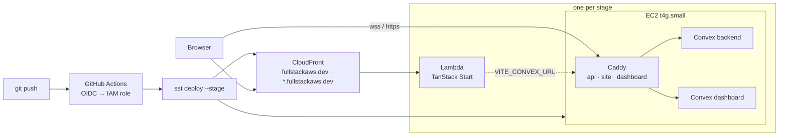

# mnlth

A full-stack TypeScript app on your own AWS account. TanStack Start on Lambda,
a self-hosted Convex backend on EC2, one shared CloudFront in front, all
described in SST and deployed by `git push`.

- **Push `main`, ship production.** Branches and pull requests get their own
  full stage at `<name>.fullstackaws.dev`, removed when the PR closes.
- **Convex without the cloud bill.** The open-source backend runs on a single
  arm64 instance behind Caddy, with real-time queries, a dashboard, and TLS
  from a wildcard certificate.
- **Nothing to log in to.** CI assumes an IAM role through OIDC. Admin keys
  are minted by the backend and kept in SSM. No secrets live in GitHub.
- **Runs on a laptop with only Docker.** `bun dev` brings up the same
  compose stack the servers run.
- **The loop around the code.** Slack says when a deploy lands. See
  [Working on it](#working-on-it).

## Quick start

### Prerequisites

- [Bun](https://bun.sh) 1.4: `curl -fsSL https://bun.sh/install | bash` on
  macOS, Linux and WSL; `powershell -c "irm bun.sh/install.ps1 | iex"` on
  Windows. It runs every script, installs packages, and runs Turbo, Vite and
  SST. Node is not needed.
- [Docker](https://docs.docker.com/get-docker/) with Compose v2: Docker
  Desktop on macOS and Windows (WSL 2 backend), the `docker-ce` and
  `docker-compose-plugin` packages on Linux.

Deploying to AWS from your own machine additionally needs the
[AWS CLI](https://docs.aws.amazon.com/cli/latest/userguide/getting-started-install.html)
with credentials for the account; see [Deploying](#deploying).

### On your machine, Docker only

```bash
bun install
bun dev            # backend + dashboard in Docker, functions pushed on save, Vite on :3000
bun run down       # stop the containers
bun run reset      # stop them and wipe the local database and files
```

`bun dev` is `turbo dev`. Every `dev` task depends on the backend package's
`setup-dev` task (`turbo.json`), which runs `scripts/setup-dev.ts`: it starts
`docker/docker-compose.yml` with a generated `INSTANCE_SECRET` kept in
`docker/.env` (gitignored, so the admin key stays valid across restarts),
mints an admin key into `packages/backend/.env.local` for the Convex CLI, and
writes `VITE_CONVEX_URL=http://127.0.0.1:3210` to `apps/web/.env.local`.
It also puts the key in `docker/.env` as `NEXT_PUBLIC_ADMIN_KEY`, so the
dashboard at http://127.0.0.1:6791 signs in by itself. Turbo then runs
`convex dev` and Vite, one TUI pane each; switch with the arrow keys.

### A personal stage in AWS

```bash
bun sst dev --stage <you>
```

Deploys the stage (its EC2 backend included, so the first run takes a few
minutes), then runs Vite on http://localhost:3000 against that stage's
backend. Push function changes with `bun convex:deploy --stage <you>`, or run
`bun convex:deploy --stage <you> --dev` alongside to push on every save. Only
point `sst dev` at your own stage, never at `staging` or `production`: it
leaves dev-mode resources behind until the next `sst deploy`.

### Adding UI components

```bash
bunx shadcn@latest add button -c apps/web
```

Components land in `packages/ui/src/components` and are imported from the
workspace package:

```tsx
import { Button } from "@workspace/ui/components/button"
```

Backend functions reach the web app as generated types:

```tsx
import { api } from "@workspace/backend/convex/_generated/api"
import { useQuery } from "convex/react"

const messages = useQuery(api.chat.getMessages)
```

## Stack

| Layer | What | Where it runs |
| --- | --- | --- |
| Web | [TanStack Start](https://tanstack.com/start) (React 19, TanStack Router), Vite 8, Tailwind 4, [shadcn/ui](https://ui.shadcn.com) on Base UI | Lambda with response streaming, behind one CloudFront distribution shared by every stage |
| Backend | [Convex](https://convex.dev) self-hosted: functions in `packages/backend/convex`, SQLite or RDS, files on the volume or S3 | One `t4g.small` EC2 instance per stage, Docker Compose, Caddy for TLS |
| Infrastructure | [SST v4](https://sst.dev) with a custom `ConvexBackend` component | `sst.config.ts`, `infra/` |
| Delivery | GitHub Actions, OIDC to AWS, one reusable deploy workflow | `.github/workflows` |
| Tooling | Bun, Turborepo, Biome, TypeScript 6 | |
| Tests | Vitest + convex-test for functions, `bun test` for scripts | `ci.yml` |

## Architecture



Production owns the shared pieces: the VPC, the certificate bucket Caddy keeps
its wildcard certificate in, and the CloudFront router whose `*.fullstackaws.dev`
alias is how every other stage gets a subdomain without a distribution of its
own. It publishes their ids to SSM; every other stage reads them at deploy
time. Production deploys first and is removed last.

| | Production | Any other stage |
| --- | --- | --- |
| Web | `fullstackaws.dev` | `<stage>.fullstackaws.dev` |
| Convex | `api.` · `site.` · `dashboard.fullstackaws.dev` | `<stage>-api.` · `<stage>-site.` · `<stage>-dashboard.fullstackaws.dev` |

## Repository

```
apps/web/                  TanStack Start app (Nitro aws-lambda preset in vite.config.ts)
packages/backend/convex/   Convex schema and functions
packages/ui/               shadcn/ui components, Tailwind config, global CSS
infra/convex-backend.ts    the ConvexBackend component: instance, Caddy, DNS, SSM, S3, RDS
packages/backend/convex/*.test.ts  function tests with convex-test, run by vitest
CLAUDE.md                  house rules for reviewers and agents
infra/shared.ts            production publishes shared ids to SSM; other stages read them
docker/docker-compose.yml  the Convex stack, run by the instances and by `bun dev`
scripts/convex-deploy.ts   pushes functions to a stage's backend (URL and key from SSM)
scripts/convex-clone.ts    anonymized copy of a stage's data into another stage or local, via CodeBuild
scripts/clone/cloud.ts     the export, anonymize and import that the clone build runs
infra/clone-job.ts         the CodeBuild project, its role, the snapshot bucket, the developer policy
scripts/clone/anonymize.ts rewrites an unzipped snapshot export per the rules
scripts/lib/stage.ts       how the scripts find a stage's URL and admin key
packages/backend/clone/    per-field anonymization rules, checked against the schema in CI
scripts/setup-dev.ts    the local backend in Docker, admin key and env files; turbo runs it before dev
scripts/reset-aws.sh       empties a region with the AWS CLI, independent of SST state
scripts/bake-ami.sh        builds the prebaked AMI the instances boot from, with the AWS CLI
sst.config.ts              the app: domain, region and the per-stage choices are literals in it
```

## Deploying

Git drives every deployment. GitHub Actions assumes the `github-actions-sst`
IAM role through OIDC, runs Biome and typecheck, then `sst deploy` and the
Convex functions push.

| Git event | Stage | Lifetime |
| --- | --- | --- |
| push to `main` | `production` | permanent, protected |
| push to a branch listed in `deployments.json` | that stage | until removed |
| pull request #N | `pr-N` | removed when the PR closes |
| any other branch | none, lint and typecheck only | |

Which branches deploy is `deployments.json` at the repository root, branch
name to stage name. Adding a developer or an environment is one line there.
Without the file, only `main` deploys, to `production`.

```json
{ "main": "production", "staging": "staging", "christianstamati": "christianstamati" }
```

Pull requests from forks and draft pull requests are not deployed. A PR gets
a comment with its URLs after each deploy. The first deploy of a new stage
takes ten to twenty-five minutes (the box boots, pulls images, gets its
certificate, mints its admin key); later pushes take a few.

| Workflow | Runs on | Does |
| --- | --- | --- |
| `ci.yml` | every push and PR | Biome, typecheck, tests |
| `deploy.yml` | called by the others | the one deploy job, then a Slack post to `#deploys` |
| `deploy-branch.yml` | push | maps the branch through `deployments.json` and deploys |
| `deploy-pr.yml` | PR opened, pushed, reopened, ready for review | deploys `pr-N` and comments its URLs |
| `remove-pr.yml` | PR closed | `sst remove --stage pr-N`, drops its state |
| `sweep-stages.yml` | Mondays, or by hand | removes `pr-*` stages whose PR is closed |
| `manual.yml` | Actions tab | `deploy`, `remove`, `unlock` or `refresh` any stage |
| `release.yml` | push to `main` | keeps the release PR current; tags and publishes when it merges |

`main` is protected by a ruleset: pull requests only, squash merges, the
`check` job green, no force pushes. Production deploys wait for one approval
in the `production` GitHub Environment.

`unlock` is for a job that died mid-deploy and left the state lock behind;
`refresh` for after something was changed by hand in AWS.

### From a laptop

The same commands CI runs:

```bash
bun sst deploy --stage production
bun convex:deploy --stage production --wait
bun sst remove --stage <stage>      # production refuses
```

### CI credentials

The role's trust policy accepts tokens whose subject names this repository.
GitHub includes the owner's and repository's numeric ids in that subject, so
the policy matches both `repo:christianstamati/mnlth:*` and
`repo:christianstamati@<owner id>/mnlth@<repo id>:*`. Its ARN is the
repository variable `AWS_ROLE_ARN`. Nothing else is stored in GitHub.

### SST Console

The [SST Console](https://console.sst.dev) reads state straight from the
`sst-state-*` bucket, so it lists every stage whoever deployed it, with its
outputs, the web Lambda's logs and its uncaught errors. Connect the AWS
account there once and pick `eu-central-1`.

#### Autodeploy

Autodeploy is off. Deploys run from GitHub Actions, and the Console would
take the same state lock and one of them would fail. Keep the repository
disconnected under the app's Autodeploy settings in the Console.

### Deployment settings

There is no settings file. What varies per deployment is a handful of
literals in `sst.config.ts`: the `region` and `domain` constants at the top
of the file, `protect` and `removal` in `app()`, and the Convex backend's
`storage` (`volume` | `s3`) and `database` (`sqlite` | `postgres` | `mysql`)
in `run()`. The scripts read the region from its line with `sed`.
`production` is protected and retained; everything else is removed.

## The Convex backend

### What the instance runs

Amazon Linux 2023 on arm64. At first boot, userData installs Docker and the
compose plugin, downloads a Caddy build with the Route 53 and S3 plugins,
writes `docker/docker-compose.yml` and a `.env` assembled from SSM, and starts
both. Caddy terminates TLS for the three hostnames with one wildcard
certificate for `*.fullstackaws.dev` (DNS-01 through Route 53), stored in the
shared certificate bucket so it is issued once for every stage and every
replacement instance. The compose ports are bound to loopback; the security
group opens 80 and 443 to the internet and 22 to EC2 Instance Connect's range
only.

| Public host | Local target | What |
| --- | --- | --- |
| `<prefix>api.` | `127.0.0.1:3210` | API and WebSocket |
| `<prefix>site.` | `127.0.0.1:3211` | HTTP actions (404 until functions are deployed) |
| `<prefix>dashboard.` | `127.0.0.1:6791` | Dashboard |

### The machine image

Installing Docker and pulling the images at boot takes ten minutes or more,
so `amiId` in `sst.config.ts` points at a prebaked AMI that already has
Docker, the compose plugin, the Caddy build and both Convex images on the
disk. A stage boots from it in under a minute. The image holds only what is
identical across stages: the compose file, the Caddyfile and the secrets are
still written at boot.

```bash
bun bake:ami --replace
```

builds a new one with the AWS CLI alone: a throwaway VPC, a builder instance
whose userData installs everything and shuts itself down, `create-image`, a
boot test of the result, then the VPC and both instances are deleted. Six
minutes. The compose plugin version and Caddy URL come from
`infra/convex-backend.ts` and the image digests from
`docker/docker-compose.yml`, so rebake after changing any of them and put
the printed id in `sst.config.ts`. `--replace` deregisters the previous
`convex-backend-*` AMIs and their snapshots once the new one passes its
boot test. The AMI is a head start, not a requirement: with `amiId` unset
the stock Amazon Linux image is used and userData installs the same things.
`scripts/reset-aws.sh --keep-images` preserves the AMI through a region
reset.

### Functions

The backend comes up empty; the functions in `packages/backend/convex` have
to be pushed into it. The Convex CLI needs `CONVEX_SELF_HOSTED_URL` and
`CONVEX_SELF_HOSTED_ADMIN_KEY`, and the key can only come from the running
backend: the instance mints it and publishes it to SSM a few minutes into its
first boot.

`scripts/convex-deploy.ts` reads the URL from `/mnlth/<stage>/convex/url` and
the key from `/mnlth/<stage>/convex/admin-key`, waits for the backend to
answer over HTTPS (the key lands before Caddy has its certificate), and runs
`convex deploy`:

```bash
bun convex:deploy --stage production          # fails fast if the stage is not ready
bun convex:deploy --stage production --wait   # polls, up to 15 minutes
```

The stage's `INSTANCE_SECRET` is generated once and kept in SSM, so a key
stays valid across instance replacements. Keys are bound to the stage name as
well as the secret, so a `staging` key does not open `production`. A key can
be cut without the deployment running:

```bash
docker run --rm --entrypoint ./generate_key \
  ghcr.io/get-convex/convex-backend:latest <stage> "$(aws ssm get-parameter \
    --name /mnlth/<stage>/convex/instance-secret --with-decryption \
    --query Parameter.Value --output text)"
```

That key is a root credential: full read and write on every table, plus
function push. It lives in SSM and in the one process that uses it. It is
never an environment variable on the frontend, and above all never a `VITE_`
one: those are inlined into the client bundle and served to every visitor.

### Storage and database

With `storage: "s3"` the backend keeps snapshots, function modules, user
files and search indexes in five per-stage S3 buckets, so replacing the
instance costs none of it. The bucket names and an access key scoped to those
buckets reach the box through SSM. With `volume` (the default) everything
lives on the root disk and a replaced instance starts empty.

With `database: "postgres"` or `"mysql"` an RDS instance in a private subnet
holds the tables; the connection string is the SSM parameter
`/mnlth/<stage>/convex/database-env`. Moving a deployment that already holds
data between storage or database modes is an export and import, not a
restart:

```bash
bunx convex export --path snapshot.zip
bunx convex import --replace-all snapshot.zip
```

### Cloning data between stages

`convex:clone` copies one stage's data into another stage or the local
backend, anonymized on the way. One command; the work happens in a
CodeBuild project in the account, so the source's data and admin key never
leave AWS and never reach your machine:

```bash
bun run convex:clone --from production --to dev            # cloud to cloud
bun run convex:clone --from production --to local          # cloud to laptop
bun run convex:clone --from production --to local --include-file-storage
```

The script starts a build of the `mnlth-clone` project
(`infra/clone-job.ts`, created by the production stage), prints its id and
follows its log. The build clones `main`, reads both stages' URL and admin
key from SSM, exports, rewrites every table per
`packages/backend/clone/rules.ts` (`scripts/clone/cloud.ts`), and imports
with `convex import --replace-all` so the target ends up holding exactly
the source's tables. For `local` it drops the anonymized zip into a bucket
whose objects expire after a day; the script downloads it, imports it into
the Docker backend (`bun dev` has to be running) and deletes it. Production
is never a target; the anonymization rules that run are the ones on
`main`, not in your working tree.

Two things by hand, once. The production deploy creates a CodeConnections
connection to GitHub in the pending state: open Developer Tools >
Connections in the Console, pick `mnlth-github`, and finish the GitHub
authorization, or no build can clone the repository. And developers need
the `mnlth-clone-developer` managed policy (its ARN is the
`cloneDeveloperPolicyArn` output) attached to their user or group. It
allows starting and watching that one project, reading its log group, and
getting and deleting snapshots. Nothing on production, and no SSM. The
build's own role reads `/mnlth/*/convex/*`, writes the bucket and its log,
and uses the connection. Every start is a CloudTrail event with the
caller's identity; the log is in CloudWatch for two weeks.

`rules.ts` says what happens to each field: `hash`, `email` and `name` are
stable within one clone, so references between documents survive; `redact`
and `remove` do what they say; `file` keeps a storage reference only with
`--include-file-storage`. Every table needs an entry (`bun test` checks that
against the schema), and a table without one aborts the clone before
anything is imported. Without file storage the `_storage` table is dropped,
so fields that point at it must be optional. The import validates against
the schema deployed on the target: push the same commit to both stages
first.

## Working on it

### Branches, commits, tickets

Branch names come from Linear ("copy git branch name"):
`chris/mnl-42-short-title`. Pushing one moves MNL-42 to In Progress, opening
the pull request moves it to In Review, merging moves it to Done; turn those
three on in Linear's GitHub integration. Commit subjects are conventional,
with the key at the end: `feat(chat): add timestamps (MNL-42)`. The PR title
becomes the squash subject. The preview comment on the PR links back to the
issue when the branch carries a key.

### Versions and releases

Every pull request that changes what ships adds a changeset:

```bash
bun changeset
```

It asks for the bump (patch, minor, major) and one sentence for the release
notes. CI refuses a PR without one unless it has the `no changeset` label.
On every push to `main`, `release.yml` updates a "chore: release" pull
request that bumps `apps/web/package.json` and writes
`apps/web/CHANGELOG.md`. Merging it tags `web@<version>`, publishes the
GitHub Release from that changelog section and posts it to Slack. The
release PR is opened with the workflow token, which triggers no CI: close
and reopen it (or push to it) so the required `check` runs, then merge.
Nothing goes to npm, and only `web` is versioned: `@workspace/backend` and
`@workspace/ui` are internal and listed under `ignore`, so there is one
version and one changelog.

### Tests

```bash
bun test          # scripts/ and clone/ with bun test, convex/ with vitest
```

Convex functions are tested with `convex-test` in
`packages/backend/convex/*.test.ts`, which the CLI leaves out of the bundle.

## Watching a stage

The backend's logs stay on the box: `docker compose logs` under
`/opt/convex`. An external probe (Checkly, Better Stack) on
`fullstackaws.dev` and `api.fullstackaws.dev/version` catches what nothing
inside AWS can see, and gives a status page.

### Slack

One incoming webhook per channel, stored as a repository secret:

| Channel | Source | Secret |
| --- | --- | --- |
| `#deploys` | `deploy.yml`: production and staging always, previews on failure | `SLACK_DEPLOYS_WEBHOOK` |
| `#releases` | `release.yml`: every GitHub Release | `SLACK_RELEASES_WEBHOOK` |
| `#alerts` | the external probe | none |
| `#ci` | the GitHub Slack app: `/github subscribe christianstamati/mnlth workflows:{branch:"main"} pulls reviews` | none |
| `#product` | Linear's Slack app | none |

## Operating a stage

### Shell access

Neither opens a port to the internet at large:

```bash
aws ssm start-session --target <instanceId>                                  # Session Manager
aws ec2-instance-connect ssh --instance-id <instanceId> --os-user ec2-user   # SSH via Instance Connect
```

The instance id is in the deploy outputs and in the SST Console. Setting
`keyPairId` in `sst.config.ts` to an existing key pair installs it for
`ec2-user` and opens port 22 to everyone, so plain `ssh -i` works too.

### Reaching the database

RDS has no route from the internet. Forward a port through the instance with
Session Manager (`brew install --cask session-manager-plugin` once), using
the host from the `database-env` parameter:

```bash
aws ssm start-session --target <instanceId> \
  --document-name AWS-StartPortForwardingSessionToRemoteHost \
  --parameters '{"host":["<rds host>"],"portNumber":["3306"],"localPortNumber":["3306"]}'
```

Rows are Convex's internal storage format, not the app's documents one to
one. Treat the connection as read-only for debugging; edit data through
functions or the dashboard.

### Triage on the box

```bash
sudo tail -100 /var/log/cloud-init-output.log   # a fresh instance that came up wrong; the last lines are the failure
cd /opt/convex && docker compose ps             # what is running, and healthy
docker compose logs --tail=100 backend
journalctl -u caddy -n 50 | grep -iE "certificate|error|obtain"
free -h; df -h /; sudo dmesg -T | grep -iE "oom|killed process"
```

Normal on a `t4g.small`: 500 to 600 MiB of memory idle, 5 to 7 GiB of the
20 GiB root disk, load under 0.5. EC2 publishes no memory or disk metrics, so
those come from the box. `t4g` is burstable: a `CPUCreditBalance` trending
toward zero means the instance is undersized, not momentarily busy. A
container that vanished without an error in its own logs was probably killed
by the OOM killer. `unknown` from `/version` is normal for self-hosted images.

## Removing a stage

`production` is protected: `sst remove` refuses it until `protect` is edited
in the `app()` function of `sst.config.ts`. Every other stage removes cleanly, and pull request
stages remove themselves.

What `removal: "retain"` keeps is SST's fixed list, not everything: the VPC,
subnets, default security group, and any RDS instance, subnet group and
parameter group. Internet gateway and route tables go, so a retained
production removal leaves a VPC with no routing plus a billing database. Two
things to know before tearing production down:

- `protect` is read from config at run time; `removal` and RDS deletion
  protection are read from state and from the live instance, so an edit to
  those does nothing until a deploy carries it.
- SST has reported "Deleted" for VPCs and subnets it retained. Check the
  account afterwards, and if the RDS instance was retained but its subnet
  group was not, delete the instance by hand and re-run the remove.

The shared VPC, certificate bucket and router belong to production. A
non-production stage references them and cannot delete them, whatever its
removal policy says.

## Resetting the AWS account

When `sst remove` has left carcasses behind or orphans no stage tracks, empty
the whole region with the AWS CLI instead of SST state:

```bash
bun reset:aws --dry-run   # inventory of what would go; region from sst.config.ts
bun reset:aws             # asks you to type the region name, then deletes
```

It keeps the `sst-state-*` / `sst-asset-*` buckets and `/sst/*` parameters
(`--include-sst` takes them too, at the cost of every stage's state and
passphrase) and the region's default VPC (`--include-default-vpc`). IAM,
Route 53 and CloudFront are global, so it only reports them at the end.
Run it with nothing you want to keep in the region: it deletes everything,
not just this app. EC2 key pairs go too, so a `keyPairId` in `sst.config.ts`
must be recreated afterwards.

What survives every teardown, on purpose: the Route 53 zone, the SST state
and asset buckets, the `github-actions-sst` role, and the `/sst/*` parameters.
